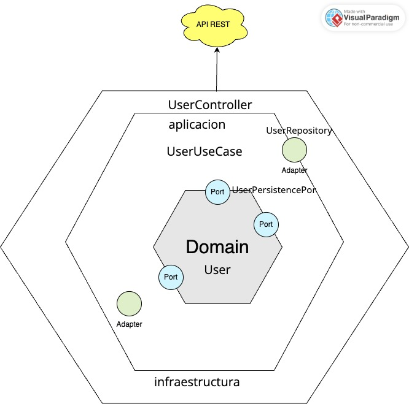

# reto-nisum
# Spring WebFlux API REST with H2 Database

This is a simple example of a Spring WebFlux API REST application that uses an H2 in-memory database. The application demonstrates basic CRUD (Create, Read, Update, Delete) operations for a resource.

## Prerequisites

- Java 11 or higher
- Maven

## Technologies Used

- Spring Boot
- Spring WebFlux (Reactive Web)
- H2 Database (In-memory)

## Getting Started

1. Clone the repository:
   git clone https://github.com/alfredjava/reto-nisum
   cd reto-nisum
2. Build the project:
   mvn clean package
3. Run the application:
4. mvn spring-boot:run

    The application will start on `http://localhost:8080`.
    
    ## API Endpoints
    
    The following are the available API endpoints:

- **Create a Resource**
- POST /api/users
  - Request Body:
    {
    "name": "Alfredo",
    "email": "alfredfis5@gmail.com",
    "password": "holas1Holas7",
    "phones": [
    {
    "number": "953727079",
    "cityCode": "01",
    "countryCode": "+51"
    }
    ]
    }

## Diagrama
// insertar diagrama de arquitectura hexagonal front resources directory

